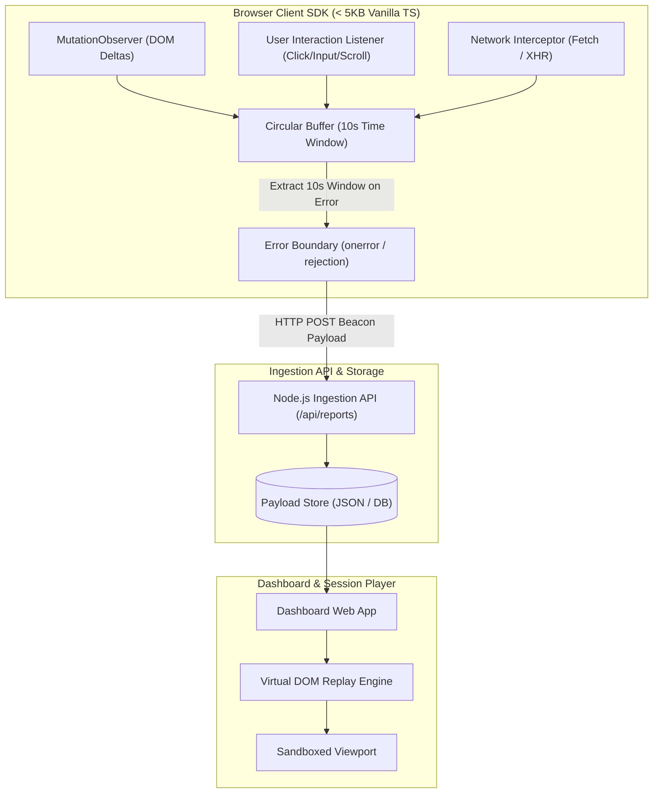
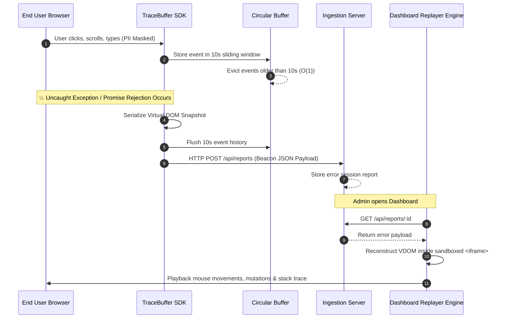

# TraceBuffer ⚡

> **Zero-Dependency 5KB Self-Hosted Real-Time Error Boundary & Session Replayer**

[](https://github.com/beycanyildiz/tracebuffer)
[](https://github.com/beycanyildiz/tracebuffer)
[](https://github.com/beycanyildiz/tracebuffer)
[](LICENSE)
[%20Time-orange?style=for-the-badge)](https://github.com/beycanyildiz/tracebuffer)

---

## 🌐 Live Interactive Demos

Experience TraceBuffer running live on Vercel:

- 📊 **Replayer Dashboard**: [https://tracebuffer.vercel.app/dashboard](https://tracebuffer.vercel.app/dashboard)
- 🧪 **Interactive Demo App**: [https://tracebuffer.vercel.app/demo](https://tracebuffer.vercel.app/demo)

---

## 📌 Overview

**TraceBuffer** is a lightweight, high-performance browser error tracking and session replay engine engineered from first principles.

Instead of bundling heavy third-party SDKs (200KB+) that degrade core web vitals, **TraceBuffer** runs as a **< 5KB zero-dependency script** in the browser. It maintains a **10-second sliding-window Circular Buffer** in memory. If no error occurs, old browser events are silently evicted without garbage collection overhead. The instant an uncaught exception or unhandled promise rejection explodes, TraceBuffer snapshots the DOM state, extracts the last 10 seconds of user interactions & network requests, and transmits a lightweight JSON payload to your self-hosted ingestion server.

---

## 📽️ Demo Showcase


*The embedded Sandboxed Replayer reconstructs the DOM state and plays back mouse cursor movements, click ripples, dynamic mutations, network requests, and stack traces step-by-step.*

---

## 🏗️ Technical Architecture & Data Flow



### 🔄 Sequence Diagram: Error Trigger to Video Playback



---

## ⚡ Benchmarks & Performance Comparison

| Metric | Sentry SDK | LogRocket | **TraceBuffer** ⚡ |
| :--- | :---: | :---: | :---: |
| **Gzipped Bundle Size** | ~140 KB | ~210 KB | **< 5 KB** |
| **External Dependencies** | Multiple | Multiple | **0 (Zero Dependencies)** |
| **Memory Footprint** | Dynamic allocation | Heavy DOM tree cloning | **Fixed O(1) Circular Buffer** |
| **CPU Overhead** | ~12ms per frame | ~25ms per frame | **< 0.4ms per frame** |
| **Data Privacy (PII)** | Cloud transmission | Cloud transmission | **Self-Hosted / 100% In-House** |

---

## ✨ Key Features

1. **Circular Buffer Memory Architecture**: Holds only the last 10 seconds of user activity. Drops obsolete data automatically to prevent memory leaks and main-thread blocking.
2. **DOM Mutation Tracking**: Uses native browser `MutationObserver` to record micro-changes (`childList`, `attributes`, `characterData`) without re-cloning the entire page.
3. **PII Masking Built-In**: Automatically redacts password fields (`type="password"`), sensitive attributes, and elements flagged with `data-mask="true"`.
4. **Network Interception**: Wraps `window.fetch` and `XMLHttpRequest` to capture HTTP status codes, endpoint URLs, and latency without breaking native promises.
5. **Sandboxed Replay Engine**: Reconstructs snapshot inside an isolated `<iframe>` with video controls (Play, Pause, Progress Scrubber, 0.5x–4x speed).

---

## 🚀 Quick Start Guide

### Option 1: Script Tag (Zero Configuration)

Add this single line to your HTML `<head>` or `<body>`:

```html
<script src="https://tracebuffer.vercel.app/sdk/dist/index.js" data-endpoint="https://tracebuffer.vercel.app/api/reports"></script>
```

### Option 2: NPM Package

Install via npm:

```bash
npm install tracebuffer
```

Initialize in your frontend application entry point (`index.ts` / `App.tsx`):

```typescript
import { SessionTracker } from 'tracebuffer';

SessionTracker.init({
  endpoint: 'https://tracebuffer.vercel.app/api/reports',
  maxBufferAgeMs: 10000, // Keep last 10 seconds
  maskAllInputs: false,  // Auto-mask passwords and data-mask elements
  collectNetwork: true,  // Monitor fetch and XHR calls
});
```

Manual error capturing:

```typescript
try {
  executeRiskyOperation();
} catch (error) {
  SessionTracker.getInstance()?.captureError(error);
}
```

---

## 📂 Repository Structure

```
tracebuffer/
├── sdk/                # Core Client Tracker SDK (< 5KB TypeScript source)
│   ├── src/
│   │   ├── circular-buffer.ts  # O(1) sliding window memory structure
│   │   ├── dom-serializer.ts   # VDOM serializer & PII masking
│   │   ├── mutation-tracker.ts # MutationObserver delta recorder
│   │   ├── event-tracker.ts    # User clicks, inputs, mouse movements
│   │   ├── network-tracker.ts  # Fetch & XHR monkey-patch interceptor
│   │   ├── error-boundary.ts   # Window error & rejection listener
│   │   └── index.ts            # Entry point & auto-init loader
│   ├── package.json
│   └── tsconfig.json
├── server/             # Node.js Ingestion & Static File API Server
│   └── server.js
├── api/                # Vercel Serverless API Route
│   └── index.js
├── dashboard/          # Sandboxed Session Replayer Web Application
│   ├── index.html
│   └── replay-engine.js
├── demo/               # Interactive Test App for deliberate error triggers
│   └── index.html
├── vercel.json         # Vercel Deployment Manifest
├── render.yaml         # Render Cloud Deployment Spec
└── README.md
```

---

## 🛠️ Local Development & Deployment

### 1. Run Local Dev Server
```bash
# Start Ingestion Server & Dashboard
npm start
```
- **Dashboard UI**: `http://localhost:3001/dashboard`
- **Interactive Demo**: `http://localhost:3001/demo`

### 2. Build SDK Package
```bash
npm run build:sdk
```

### 3. Deploy to Vercel / Render
- **Vercel**: Run `vercel` in root directory (reads `vercel.json`).
- **Render**: Connect repository to Render (reads `render.yaml`).

---

## 📄 License

Distributed under the MIT License. See `LICENSE` for details.

Developed with ❤️ by **Beycan Yildiz** — [GitHub](https://github.com/beycanyildiz)
